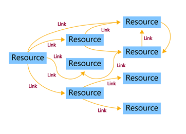
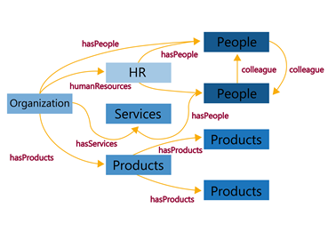

## Podstawa Linked Open Data

{}

* Podmiot - subject
* Orzeczenie - predicate
* Dopełnienie lub obiekt - object

Składając te trójki razem uzyskujemy coraz bardziej złożone grafy.

<!---  Zajęcia zaczęliśmy od powtórzenia czym jest URI, IRI. URI- Uniform Resource Identifier- służy do identyfikacji zasobów w sieci. IRI- Internationalized Resource Identifier- również identyfikuje zasoby, ale uwzględnia jeszcze inne znaki niż te w alfabecie łacińskim. Podstawą Open linked data są trójelementowe grafy składające się z: 
●Podmiot - subject; 
●Orzeczenie - predicate; 
●Dopełnienie lub obiekt - object. 
Składając te trójki razem uzyskujemy coraz bardziej złożone grafy  -->

## Sieć semantyczna

{} {}

Języki RDF powstały do opisu sieci semantycznej.

1. RDF- Resource Description Framework

2. RDFs- Resource Description Framework Schema

3. RDFa- Resource Description Framework in Attributes

<!--- RDF- Resource Description Framework- jest środowiskiem(wzorcem języków) dla wyrażania informacji o zasobach, opracowana przez W3C. Zasobem może być wszystko np. dokumenty, ludzie, przedmioty fizyczne, pojęcia abstrakcyjne. RDF jest przeznaczony dla aplikacji, które przetwarzają informacje w Internecie. RDF jest wspólnym środowiskiem pomiędzy komputerami, w którym można wymieniać informacje w taki sposób, że jej wymiana nie prowadzi do utraty sensu.  -->

## Przykład grafu RDF

{}

Z naszego przykładu:

1. Subject: http://dbpedia.org/resource/Poland

2. Predicate: \textcolor{yellow}{http://dbpedia.org/ontology/officialLanguage}

3. Object: **http://dbpedia.org/resource/Polish_language**

<!--- URI odnoszą się do konkretnej rzeczy, przedmiotu, relacji w świecie.
Trójki stwierdzają pewne fakty w świecie, łączą za pomocą relacji podmioty z danymi lub innymi podmiotami.  -->

## Zasób i własności

Zasobem nazywamy wszystko poza danymi.

Własności (relacje) łączą zasoby z zasobami lub zasoby z danymi.

## Nazwa kwalifikowana

Nazwa niekwalifikowana: http://dbpedia.org/resource/Poland

Nazwa kwalifikowana: dbr:Poland

Do zdefiniowania danej nazwy używam *@prefix:* 
**@prefix dbr:http://dbpedia.org/resource/**

Sposobem zapisu definicji jest notacja BNF (Backus–Naur form).

<!---  Nazwa niekwalifikowana: http://dbpedia.org/resource/Poland
Nazwa kwalifikowana: dbr:Poland
Do zdefiniowania danej nazwy używam @prefix: @prefix dbr:http://dbpedia.org/resource/
Sposobem zapisu definicji jest notacja BNF (Backus--Naur form).
Definicje składają się ze słów, które definiujemy, aż dojdziemy do znaków, których można użyć. -->

## Literał

\begin{center}

Literał jest wartością, która nie jest zasobem: tekstem, liczbą, datą- 
 OPIS A NIE OBIEKT W ŚWIECIE.

\end{center}

Każdy literał należy do innego typu danych(data type):

* liczba całkowita(https://www.w3.org/TR/xmlschema11-2/#integer);

* tekst(https://www.w3.org/TR/xmlschema11-2/#string);

* data(https://www.w3.org/TR/xmlschema11-2/#date);

* itd.

Literał składa się z dwóch lub trzech części.

Typ danych możemy zapisać również po \textcolor{yellow}{^^} po danym literale.

<!--- Literał jest wartością, która nie jest zasobem: tekstem, liczbą, datą- OPIS A NIE OBIEKT W ŚWIECIE.
Każdy literał należy do innego typu danych(data type):
liczba całkowita(https://www.w3.org/TR/xmlschema11-2/#integer);
tekst(https://www.w3.org/TR/xmlschema11-2/#string);
data(https://www.w3.org/TR/xmlschema11-2/#date);
itd.
Literał składa się z dwóch lub trzech części.
formy leksykalnej zapisanej w cudzysłowiu
IRI dla typu danych
jeżeli dany literał jest w jakimś języku możemy znacznik określający język, z którego się wywodzi. Znacznik ten zaczyna się od znaku @ a po nim dwie litery oznaczające dany język. en-angielski, pl-polski itp.
Typ danych możemy zapisać również po ^^ po danym literale. -->

## Serializacja grafów RDF

Serializacja jest to zapisanie grafów w pliku tekstowym w sposób zrozumiały dla komputera.

Typy serializacji:

* XML

* JSON

* Turtle

* N-Triples

## Słownik RDF

* Języki na podstawie RDF:
  * rdf: https://www.w3.org/1999/02/22-rdf-syntax-ns
  * rdfs: https://www.w3.org/2000/01/rdf-schema

## Klasy

rdfs:Class - zasób, zbiór wszystkich zbiorów.

rdf:type - relacja mówiąca nam, że jeden zasób jest typu innego zasobu.

\begin{center}

**IRI#1 rdf:type rdfs:Class**

\end{center}

rdfs:subClassOf- zasób jest podklasą innego zasobu.

\begin{center}

 **IRI#1 rdfs:subClassOf IRI#2**

\end{center}

<!--- rdfs:Class - zasób, zbiór wszystkich zbiorów.
rdf:type - relacja mówiąca nam, że jeden zasób jest typu innego zasobu.
IRI#1 rdf:type rdfs:Class
IRI#1 jest zbiorem typu rdfs:Class. 
np. 
dbo:Place rdf:type rdfs:Classdbo:Garbacz rdf:type dbo:Place
rdf:type możemy przyrównać do symbolu przynależności ϵ z matematyki. Gdy nie mam wprowadzonego zasobu rdfs:Class nie mogę mówić o zbiorach, bo dopiero ten zasób definiuje mi to pojęcie.
rdfs:subClassOf- zasób jest podklasą innego zasobu.
 IRI#1 rdfs:subClassOf IRI#2
Wraz z rdfs:subClassOf uzyskujemy możliwość wnioskowania o zawieraniu się zbiorów, dokładniej przechodniości.
Jeżeli
IRI#1 rdfs:subClassOf IRI#2
IRI#2 rdfs:subClassOf IRI#3
To
IRI#1 rdfs:subClassOf IRI#3 
--->

## Relacje

Podobnie jak z klasami jest też z relacjami:

* rdf:Property - tak definiujemy relację;

* rdfs:subPropertyOf- a tak podrelację danej relacji.

Do relacji odnoszą się dziedziny i przeciwdziedziny(zakresy):

{}

* rdfs:domain- dziedzina

* rdfs:range- zakres

<!--- Podobnie jak z klasami jest też z relacjami:
rdf:Property - tak definiujemy relację;
rdfs:subPropertyOf- a tak podrelację danej relacji.
Do relacji odnoszą się dziedziny i przeciwdziedziny(zakresy):
rdfs:domain- dziedzina
rdfs:range- zakres
Dziedzina i zakres to zbiory elementów. Dziedzinom relacja przypisuje elementy z zakresu.
--->